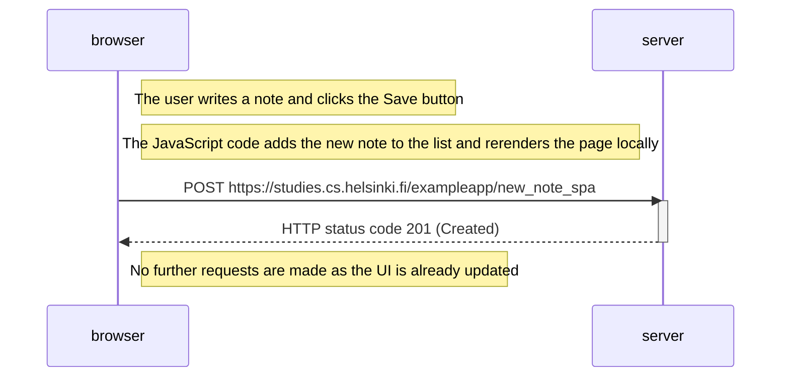

```mermaid
sequenceDiagram
    participant browser
    participant server

    Note right of browser: The user writes a note and clicks the Save button
    Note right of browser: The JavaScript code adds the new note to the list and rerenders the page locally

    browser->>server: POST https://studies.cs.helsinki.fi/exampleapp/new_note_spa
    activate server
    server-->>browser: HTTP status code 201 (Created)
    deactivate server

    Note right of browser: No further requests are made as the UI is already updated
```